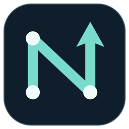
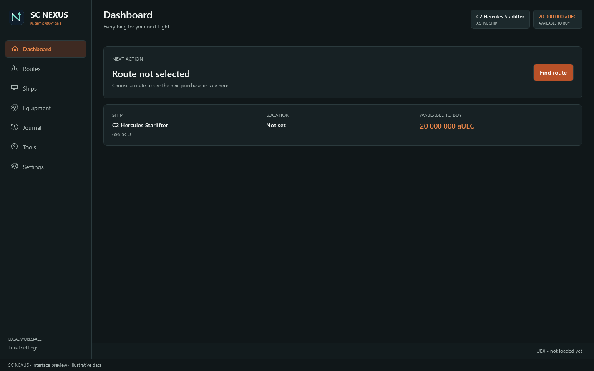
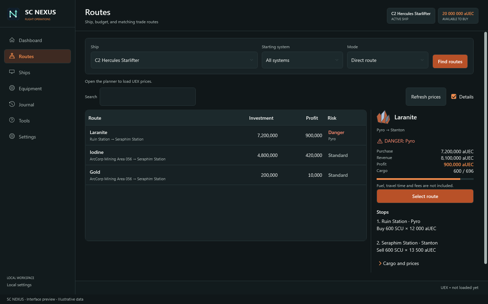
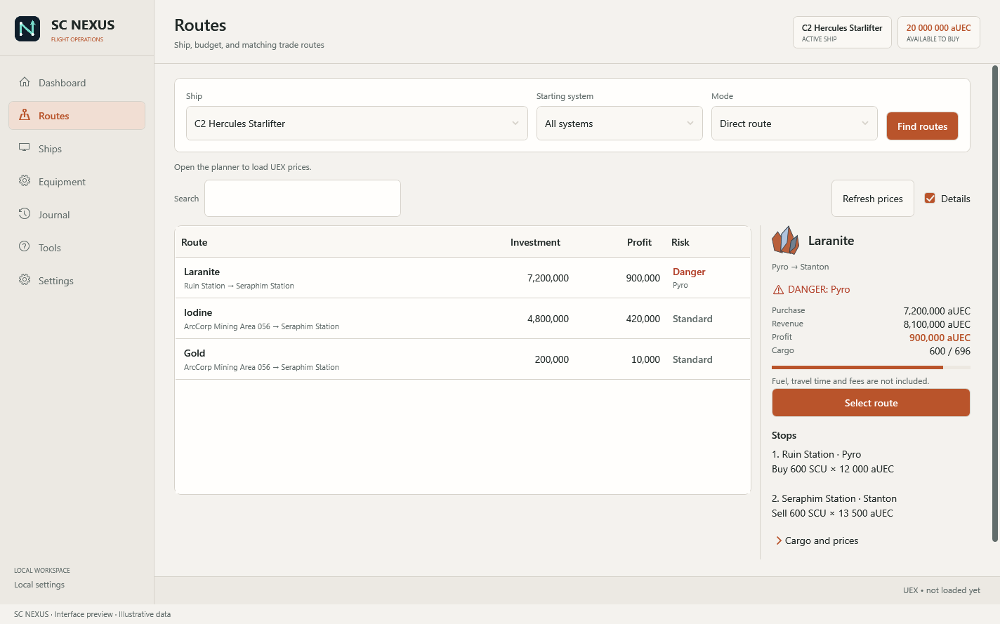
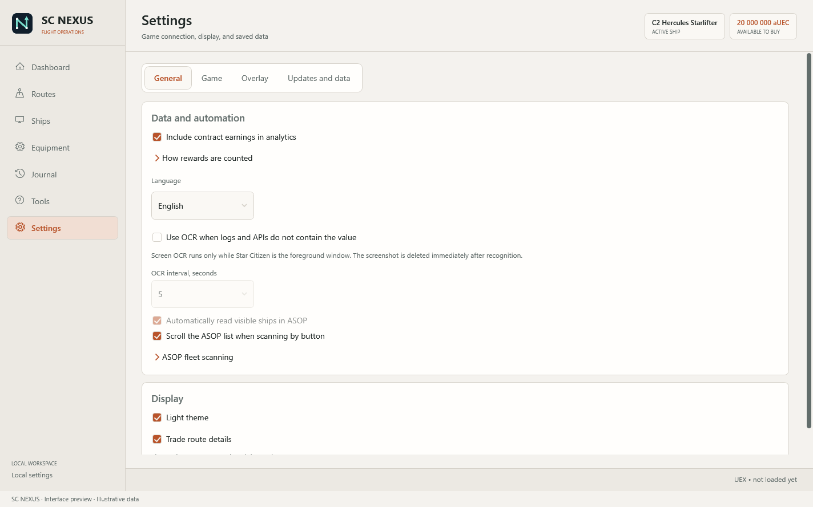
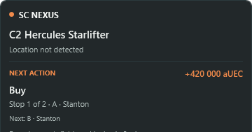

<p align="center">
  
</p>

<h1 align="center">SC Nexus</h1>

<p align="center"><strong>Компаньон для Star Citizen: корабли, экономика, аналитика и игровые данные в одном месте.</strong></p>

<p align="center">
  <a href="README.md">English</a> ·
  <a href="https://github.com/aelz1233/sc-nexus/releases/latest">Последний релиз</a> ·
  <a href="#установка">Установка</a> ·
  <a href="#возможности">Возможности</a>
</p>

SC Nexus — Windows-приложение-компаньон для **Star Citizen**. Оно собирает доступные игровые данные без вмешательства в процесс игры, объединяет их с рыночной информацией и помогает вести флот, торговые рейсы, игровые сессии и историю событий.

Основной принцип: сначала автоматические источники, ручной ввод — только когда надёжно получить значение иначе невозможно.

## Интерфейс

**Учёт контрактов можно отключить.** Настройки → Основные → «Учитывать заработок с контрактов в аналитике» (также в журнале). Выключатель исключает контракты из общего заработка и дохода в час, сохраняя записи. Автоматическое определение награды работает не для каждого задания; суммы из каталога нужно проверять. Баланс кошелька не меняется.

В текущем исходном коде доступны светлая и тёмная темы: Настройки → Основные → Светлая тема. В «Обзоре» остаётся одно следующее действие и три факта: корабль, локация и доступный на закупку бюджет — это не цена корабля. Маршруты начинаются с корабля, системы и режима; таблица всегда показывает наиболее прибыльные варианты первой и не позволяет перетаскивать или пересортировывать столбцы. Pyro/NQA отмечаются явно, а панель подробностей на узком окне переносится под таблицу. Оверлей показывает только корабль, локацию, следующее действие и риск.

Награду контракта можно искать в SC Wiki по ID типа задания из Game.log. Сумма из каталога — ожидаемая награда для указанной версии игры. Отсутствующая сумма остаётся неизвестной, диапазон не превращается в точное значение. Перед учётом в аналитике нужно подтвердить фактическую выплату. Время принятия и завершения автоматически заполняет длительность, если оба события доступны.

<p align="center">
  
</p>
<p align="center">
  
</p>
<p align="center">
  
  
</p>
<p align="center">
  
</p>
<p align="center"><em>Английский интерфейс: обзор, маршруты в двух темах, настройки и компактный оверлей. Снимки получены из приложения с демонстрационными данными, а не текущими рыночными котировками.</em></p>

## Возможности

| Раздел | Что делает приложение |
| --- | --- |
| **Обзор и состояние игрока** | Показывает следующее действие, активный корабль и вместимость, начальную локацию и доступный торговый бюджет без смешивания его с ценой корабля или неподтверждёнными данными. |
| **Маршруты и торговля** | Подбирает прямые рейсы, цепочки и сбор груза по ценам UEX, бюджету, объёму трюма и правилам безопасности. Маршруты через Pyro явно отмечаются как опасные. |
| **Флот и оснащение** | Хранит личный флот, работает с каталогом UEX, подбирает совместимые компоненты, сравнивает сборки и составляет чек-лист закупки. |
| **Автоматические игровые данные** | Инкрементально читает `Game.log`, резервные журналы и локальные файлы игры в режиме чтения; отслеживает поддерживаемые сессии, перемещения, миссии, смерти и торговые события. |
| **Оверлей и трей** | Предоставляет внешний read-only оверлей, настраиваемый бинд, меню области уведомлений и локальные уведомления. |
| **Локальная история** | Сохраняет настройки, рейсы и историю наблюдений в SQLite, создаёт резервные копии и защищает данные при обновлении. |

## Установка

Скачайте актуальную версию со страницы [GitHub Releases](https://github.com/aelz1233/sc-nexus/releases/latest).

- `SCNexus-Setup-…-win-x64.exe` — установщик с выбором папки.
- `SCNexus-…-win-x64.zip` — переносная версия одним EXE-файлом.

Релиз включает нужный runtime. Настройки, флот, баланс, история и кэш находятся в `%LOCALAPPDATA%\SCNexus`, поэтому не удаляются при обновлении или переустановке.

### Требования

| Требование | Детали |
| --- | --- |
| ОС | Windows 10 версии 1809 и новее либо Windows 11 |
| Архитектура | x64-совместимый процессор |
| Интеграция с игрой | Папки LIVE, PTU и EPTU находятся автоматически, если доступны локально |
| Интернет | Нужен для UEX, Star Citizen Wiki, обновлений GitHub и обновления внешних данных |

## Автоматический сбор данных

У каждого значения сохраняются источник, время и уверенность. Источники идут по приоритету:

1. `Game.log` и `logbackups`, обрабатываются только новые строки;
2. локальные файлы Star Citizen, только чтение;
3. API UEX и Star Citizen Wiki;
4. необязательный OCR окна Star Citizen на переднем плане;
5. ранее накопленная история Nexus;
6. ручные значения, если автоматический источник недоступен.

При первом запуске SC Nexus сам ищет LIVE, PTU или EPTU. Выбор папки вручную нужен только если автоматический поиск не нашёл установку.

## Язык и обновления

Установщик предлагает **English / Русский**. При первом запуске подтвердите язык в двуязычном окне. По умолчанию выбран язык установщика; у portable-версии — русский на русской Windows и английский на остальных системах. Обновление сохраняет язык существующего профиля. Изменить его можно в **Настройки → Язык**.

В **Настройках** нажмите **Проверить обновления**. После подтверждения приложение скачает и проверит установщик, создаст резервную копию данных, обновится в фоне и запустится снова. Для публичных релизов токен GitHub не нужен. Если GitHub не отвечает, проверка завершается через 30 секунд.

## OCR и обнаружение корабля

**Баланс:** включите OCR в настройках и оставьте панель кошелька mobiGlas рядом с **«Главная»** видимой в активном окне игры. Nexus увеличивает эту область и меняет сумму только после двух совпадающих свежих чтений. Неоднозначные результаты пропускаются. Переводы и цены не считаются балансом. Сохранённый баланс Nexus остаётся до надёжного нового чтения или ручной коррекции.

**Миссии:** обзор и оверлей показывают активные статусы, подтверждённые в текущей игровой сессии. Старые записи остаются в журнале. Известные технические имена заменены понятными подписями; исходник доступен при наведении. Журналы игры не гарантируют полный список контрактов и их официальные названия.

OCR — необязательный запасной источник, который используется, если значение нельзя надёжно получить из `Game.log`, локальных файлов игры или API. Приложение захватывает только видимое окно Star Citizen, распознаёт текст локальным Windows OCR и сразу освобождает снимок. Изображение никуда не загружается и не хранится SC Nexus.

В **Настройки → Данные и автоматизация** можно выбрать интервал OCR **5 / 10 / 20 / 30 секунд** (по умолчанию **5**), автоматическое чтение видимых строк ASOP и прокрутку списка при сканировании по кнопке.

Чтобы считать флот:

1. Запустите Star Citizen и оставьте окно игры видимым.
2. Откройте терминал **ASOP** в режиме взаимодействия и сбросьте поиск/фильтры.
3. В SC Nexus откройте **Настройки → Оверлей** и нажмите **«Сканировать ASOP»**. За три секунды переключитесь в Star Citizen: окно игры должно быть активным.
4. Прочитайте результат под кнопкой. Распознанные модели кораблей и их категории добавляются во флот.

В интерактивном списке **ASOP** кнопка читает видимые строки, прокручивает список вверх, затем вниз (не более 60 шагов / 100 секунд). Сначала сбросьте поиск и фильтры ASOP; во время проверки не двигайте курсор. **Esc**, переключение из игры или исчезновение терминала останавливают сканирование. Уже распознанные записи сохраняются. Прерванная проверка может быть неполной; неизменный список служит признаком остановки, но не гарантирует, что распознаны все корабли.

Строки **Locked / Заблокировано** исключаются. Если статус не удалось прочитать, строка тоже пропускается. Восстановление, уничтожение и доставка учитываются при распознанном статусе. Модели добавляются без повторов: доступная копия учитывается, даже если другая копия заблокирована. Категория определяется по данным UEX, с запасными правилами по названию. Пользовательские заметки сохраняются; существующие корабли сканирование не удаляет.

Английский и русский Windows OCR используются совместно, если установлены. Для русских статусов установите русский OCR в языковых настройках Windows. Кнопка работает независимо от постоянного OCR. Кнопки вызова, восстановления и покупки не нажимаются. Оверлей пропускает клики вне элементов управления. Скрытое окно, нечитаемый текст и неподдерживаемый язык могут помешать распознаванию.

### Управление оверлеем и чек-листы

- Назначьте бинд в **Настройки → Игровой оверлей**. По умолчанию он не назначен. Кроме горячей клавиши Windows, Nexus проверяет состояние назначенного сочетания при активной игре, без клавиатурных хуков. Используйте окно без рамки или оконный режим. Если бинд работает только вне игры, проверьте одинаковые права запуска Nexus и Star Citizen.
- Панель оверлея не содержит кнопок: клики всегда проходят в игру. Компактный/расширенный вид, показ и скрытие настраиваются в **Настройки → Оверлей**.
- В расширенном виде показана следующая остановка маршрута. Основной вид оставляет только корабль, локацию, следующее действие и явное предупреждение о риске.
- В конфигураторе выберите маршрут покупки и нажмите **«Закупка в оверлее»**. Отмечайте купленные модули, подтверждайте завершение остановки и переходите к следующему магазину. Можно вернуться назад и исправить отметки. Чек-лист и текущая остановка сохраняются после перезапуска.
- Если активны и торговый рейс, и закупка модулей, переключайтесь между ними кнопкой в заголовке чек-листа. Галочки не списывают деньги и не означают установку компонентов: установите их в Vehicle Loadout в игре.
- Доступны варианты с минимальной ценой, меньшим числом перелётов и сбалансированный. Порядок остановок приблизительно учитывает близость точек; это не гарантия кратчайшего пути или наличия товара.

## Источники данных

| Источник | Для чего используется |
| --- | --- |
| [UEX Corp](https://uexcorp.space/) | Котировки commodities, терминалы, каталог кораблей и предложения магазинов компонентов. Это данные сообщества, поэтому цену и запас стоит проверить в терминале игры. |
| [Star Citizen Wiki API](https://api.star-citizen.wiki/developers) | Порты кораблей, совместимость, характеристики компонентов и метаданные версии игры. |
| Локальные файлы Star Citizen | Build, контур LIVE/PTU/EPTU, журналы, сессии и поддерживаемые игровые события. Только чтение. |
| GitHub Releases | Проверка и загрузка обновлений приложения. |

## Безопасность и приватность

SC Nexus читает файлы и фоновые данные игры без изменения. Единственная автоматизация игрового интерфейса — явно запрошенный скан ASOP: программа перемещает курсор на распознанный список и прокручивает его колесом мыши. Она не использует DLL injection, чтение памяти, hooks, перехват пакетов и не изменяет файлы Star Citizen.

OCR выключен по умолчанию. После включения обрабатывается только видимое окно игры, а снимок освобождается после распознавания. Данные приложения хранятся локально в `%LOCALAPPDATA%\SCNexus`.

## Структура проекта

```text
SC-Nexus/
├── SCNexus/                 WPF-приложение
│   ├── Assets/              Логотип и иконки
│   ├── Controls/            Переиспользуемые элементы интерфейса
│   ├── Data/                Контекст SQLite через Entity Framework
│   ├── Models/              Модели игры, торговли, флота и данных
│   ├── Services/            Providers, парсинг, маршруты, обновления и хранилище
│   └── ViewModels/          Состояние приложения и команды интерфейса
├── SCNexus.Tests/           Тесты xUnit
├── installer/               Конфигурация Inno Setup
├── scripts/                 Скрипты сборки и проверки установщика
├── docs/                    Заметки к релизам
└── .github/                 CI и шаблоны совместной работы
```

## Статус и roadmap

- ✅ WPF-приложение, SQLite, установщик, переносной релиз и автоматическая публикация на GitHub
- ✅ Флот, торговые маршруты, цепочки, сбор груза, конфигуратор, оверлей, трей и русский/английский интерфейс
- ✅ Provider-архитектура с Game.log, локальными файлами, UEX, Star Citizen Wiki, OCR и историей Nexus
- 🚧 Расширение распознавания логов для новых игровых событий и изменений build-ов
- 🚧 Улучшение диагностики источников и отображения качества данных
- 📋 Дополнительные providers через существующий интерфейс `IDataProvider`

## Ограничения

Открытые локальные данные игры не дают надёжный полный список кораблей аккаунта, текущий loadout, личный инвентарь, blueprints, точный баланс или каждое событие миссии, смерти и перемещения. SC Nexus сохраняет только подтверждённые доступным источником значения и не выдумывает недостающие данные.

## Участие в разработке

Описание процесса — в [CONTRIBUTING.md](CONTRIBUTING.md). Для ошибок и предложений используйте шаблоны GitHub Issues.

## Лицензия

Для проекта пока не выбрана открытая лицензия. До её добавления права остаются у владельца репозитория; существенные изменения лучше сначала обсудить в issue.

SC Nexus — неофициальный фанатский проект. Star Citizen и связанные марки принадлежат Cloud Imperium Games.

### Заработок с контрактов
Начисления из Game.log рядом с завершением контрактов записываются в журнал. Учёт в аналитике включается в настройках данных и автоматизации. Отсутствующую выплату можно подтвердить вручную; OCR предложения только подставляет сумму для проверки. Баланс обновляется отдельно через OCR. Для дохода в час нужна известная длительность работы.

