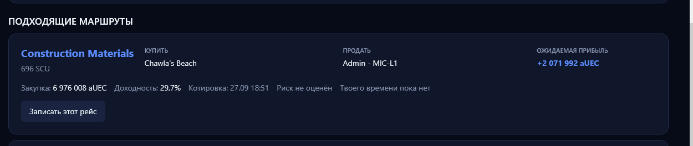
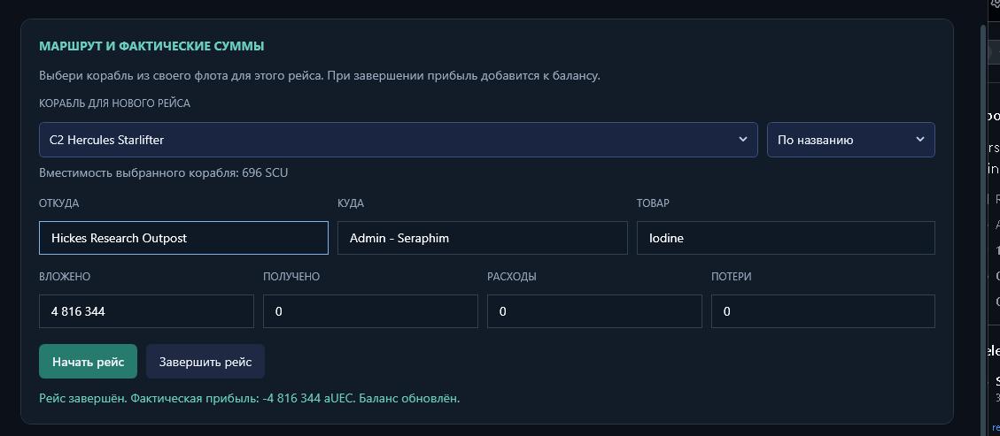
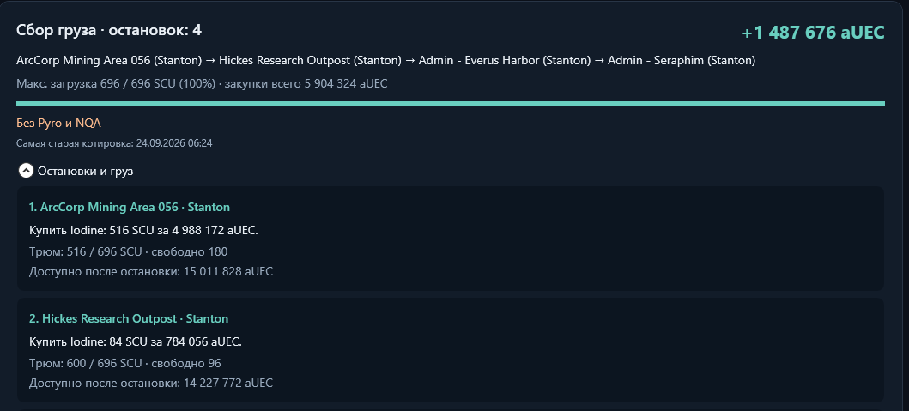

<p align="center">
  
</p>

<h1 align="center">SC Nexus</h1>

<p align="center"><strong>Компаньон для Star Citizen: корабли, экономика, аналитика и игровые данные в одном месте.</strong></p>

<p align="center">
  <a href="README.md">English</a> ·
  <a href="https://github.com/aelz1233/sc-nexus/releases/latest">Последний релиз</a> ·
  <a href="#установка">Установка</a> ·
  <a href="#возможности">Возможности</a>
</p>

SC Nexus — Windows-приложение-компаньон для **Star Citizen**. Оно собирает доступные игровые данные без вмешательства в процесс игры, объединяет их с рыночной информацией и помогает вести флот, торговые рейсы, игровые сессии и историю событий.

Основной принцип: сначала автоматические источники, ручной ввод — только когда надёжно получить значение иначе невозможно.

## Интерфейс

<p align="center">
  
</p>
<p align="center">
  
  
  
</p>

<p align="center"><em>Главный экран, анализ торговли, учёт рейса и раскрываемый план многоточечного сбора груза.</em></p>

## Возможности

| Раздел | Что делает приложение |
| --- | --- |
| **Обзор и состояние игрока** | Показывает текущую или последнюю сессию, корабль, локацию, активную миссию, build игры, данные сервера и личные торговые показатели. |
| **Маршруты и торговля** | Подбирает прямые рейсы, цепочки и сбор груза по ценам UEX, бюджету, объёму трюма, спросу, запасу и выбранным системам. Маршруты через Pyro явно отмечаются как опасные. |
| **Флот и оснащение** | Хранит личный флот, работает с каталогом UEX, подбирает совместимые компоненты, сравнивает сборки и составляет чек-лист закупки. |
| **Автоматические игровые данные** | Инкрементально читает `Game.log`, резервные журналы и локальные файлы игры в режиме чтения; отслеживает поддерживаемые сессии, перемещения, миссии, смерти и торговые события. |
| **Оверлей и трей** | Предоставляет внешний read-only оверлей, настраиваемый бинд, меню области уведомлений и локальные уведомления. |
| **Локальная история** | Сохраняет настройки, рейсы и историю наблюдений в SQLite, создаёт резервные копии и защищает данные при обновлении. |

## Установка

Скачайте актуальную версию со страницы [GitHub Releases](https://github.com/aelz1233/sc-nexus/releases/latest).

- `SCNexus-Setup-…-win-x64.exe` — установщик с выбором папки.
- `SCNexus-…-win-x64.zip` — переносная версия одним EXE-файлом.

Релиз включает нужный runtime. Настройки, флот, баланс, история и кэш находятся в `%LOCALAPPDATA%\SCNexus`, поэтому не удаляются при обновлении или переустановке.

### Требования

| Требование | Детали |
| --- | --- |
| ОС | Windows 10 версии 1809 и новее либо Windows 11 |
| Архитектура | x64-совместимый процессор |
| Интеграция с игрой | Папки LIVE, PTU и EPTU находятся автоматически, если доступны локально |
| Интернет | Нужен для UEX, Star Citizen Wiki, обновлений GitHub и обновления внешних данных |

## Автоматический сбор данных

У каждого значения сохраняются источник, время и уверенность. Источники идут по приоритету:

1. `Game.log` и `logbackups`, обрабатываются только новые строки;
2. локальные файлы Star Citizen, только чтение;
3. API UEX и Star Citizen Wiki;
4. необязательный OCR окна Star Citizen на переднем плане;
5. ранее накопленная история Nexus;
6. ручные значения, если автоматический источник недоступен.

При первом запуске SC Nexus сам ищет LIVE, PTU или EPTU. Выбор папки вручную нужен только если автоматический поиск не нашёл установку.

## OCR и обнаружение корабля

OCR — необязательный запасной источник, который используется, если значение нельзя надёжно получить из `Game.log`, локальных файлов игры или API. Приложение захватывает только видимое окно Star Citizen, распознаёт текст локальным Windows OCR и сразу освобождает снимок. Изображение никуда не загружается и не хранится SC Nexus.

Чтобы определить корабль:

1. Запустите Star Citizen и оставьте окно игры видимым.
2. Откройте **Vehicle Loadout**, **ASOP**, «Мой флот», экран выдачи корабля или HUD, где видно название модели.
3. Разверните оверлей SC Nexus в игре и нажмите **«Принудительно обнаружить корабль»**. За три секунды переключитесь в Star Citizen: окно игры должно быть активным.
4. Прочитайте результат под кнопкой. Известные модели на экране флота добавляются в обнаруженный флот. OCR меняет текущий корабль только при явной подписи **Current Ship** и точном совпадении модели с каталогом. По одному списку кораблей нельзя определить, на каком вы летите.

Кнопка запускает один OCR-скан, даже когда постоянный OCR выключен. В обычном режиме оверлей пропускает клики в игру всюду, кроме этой кнопки. Распознавание может не сработать при скрытом или свёрнутом окне игры, неразборчивом тексте, неподдерживаемом языке интерфейса или если на экране нет названия модели.

## Источники данных

| Источник | Для чего используется |
| --- | --- |
| [UEX Corp](https://uexcorp.space/) | Котировки commodities, терминалы, каталог кораблей и предложения магазинов компонентов. Это данные сообщества, поэтому цену и запас стоит проверить в терминале игры. |
| [Star Citizen Wiki API](https://api.star-citizen.wiki/developers) | Порты кораблей, совместимость, характеристики компонентов и метаданные версии игры. |
| Локальные файлы Star Citizen | Build, контур LIVE/PTU/EPTU, журналы, сессии и поддерживаемые игровые события. Только чтение. |
| GitHub Releases | Проверка и загрузка обновлений приложения. |

## Безопасность и приватность

SC Nexus — внешний помощник только для чтения. Он не использует DLL injection, чтение памяти, hooks, перехват пакетов и не изменяет файлы Star Citizen.

OCR выключен по умолчанию. После включения обрабатывается только видимое окно игры, а снимок освобождается после распознавания. Данные приложения хранятся локально в `%LOCALAPPDATA%\SCNexus`.

## Структура проекта

```text
SC-Nexus/
├── SCNexus/                 WPF-приложение
│   ├── Assets/              Логотип и иконки
│   ├── Controls/            Переиспользуемые элементы интерфейса
│   ├── Data/                Контекст SQLite через Entity Framework
│   ├── Models/              Модели игры, торговли, флота и данных
│   ├── Services/            Providers, парсинг, маршруты, обновления и хранилище
│   └── ViewModels/          Состояние приложения и команды интерфейса
├── SCNexus.Tests/           Тесты xUnit
├── installer/               Конфигурация Inno Setup
├── scripts/                 Скрипты сборки и проверки установщика
├── docs/                    Заметки к релизам
└── .github/                 CI и шаблоны совместной работы
```

## Статус и roadmap

- ✅ WPF-приложение, SQLite, установщик, переносной релиз и автоматическая публикация на GitHub
- ✅ Флот, торговые маршруты, цепочки, сбор груза, конфигуратор, оверлей, трей и русский/английский интерфейс
- ✅ Provider-архитектура с Game.log, локальными файлами, UEX, Star Citizen Wiki, OCR и историей Nexus
- 🚧 Расширение распознавания логов для новых игровых событий и изменений build-ов
- 🚧 Улучшение диагностики источников и отображения качества данных
- 📋 Дополнительные providers через существующий интерфейс `IDataProvider`

## Ограничения

Открытые локальные данные игры не дают надёжный полный список кораблей аккаунта, текущий loadout, личный инвентарь, blueprints, точный баланс или каждое событие миссии, смерти и перемещения. SC Nexus сохраняет только подтверждённые доступным источником значения и не выдумывает недостающие данные.

## Участие в разработке

Описание процесса — в [CONTRIBUTING.md](CONTRIBUTING.md). Для ошибок и предложений используйте шаблоны GitHub Issues.

## Лицензия

Для проекта пока не выбрана открытая лицензия. До её добавления права остаются у владельца репозитория; существенные изменения лучше сначала обсудить в issue.

SC Nexus — неофициальный фанатский проект. Star Citizen и связанные марки принадлежат Cloud Imperium Games.
